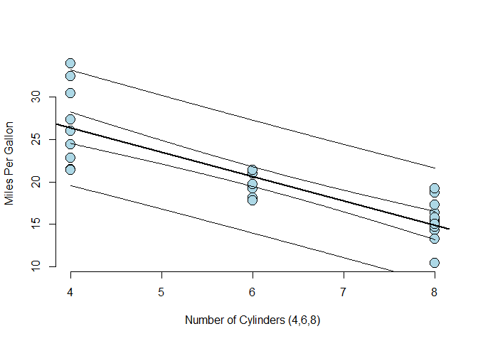
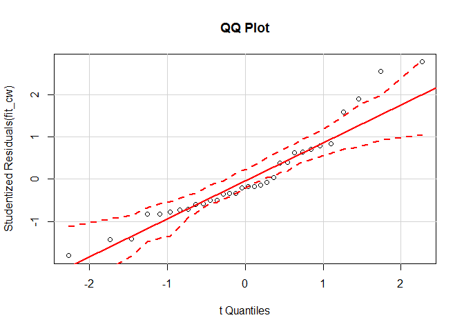
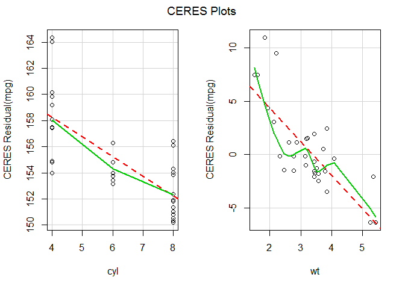

You re reading the README.md file in the **regression** GitHub repository associated with Russ Robbins. Select **regression** above to see the affiliated files. Alternatively, see the summary of the analysis below.

**Example: Recognizing assumption violations in linear regression**

**Executive Summary**

The primary purpose of this research was to determine whether an automatic or a manual transmission is better for increasing miles per gallon (MPG). The second purpose was to quantify the MPG difference between automatic and manual transmissions. Based on the data set provided, and only the data set provided, there is **no statistically significant relationship between whether a car has an automatic or a standard transmission and MPG**. Instead, the one statistically significant factor in this data set which can describe the increasing or decreasing of MPG in a linear and easily interpretable way is the number of cylinders in a car's engine. On average, the decrease in MPG from a 4 cylinder to a 6 or a 6 to a 8 cylinder engine is 5.75 miles per gallon. 4-cylinder vehicles in this data set on average have 26.38 MPG, 6-cylinder vehicles, 20.63 MPG, and 8-cylinders, 14.88 MPG. Further, and taking into consideration **quantifying uncertainty, (and the variability seen in the data) I expect the range of decrease in MPG from a 4 to 6 or a 6 to 8 cylinder should be no less than 4.43 miles per gallon (2 cyl times a 2.215 MPG decrease) and no greater than 7.07 gallons (2 cyl times 3.53 MPG decrease), in 95 out of 100 cases**.
 
Model

```
##             Estimate Std. Error   t value     Pr(>|t|)
## (Intercept) 37.88458  2.0738436 18.267808 8.369155e-18
## x           -2.87579  0.3224089 -8.919699 6.112687e-10
```
95% Confidence Interval (per cylinder)

```
## [1] -7.068474 -4.434687
```

##Analytical Strategy
1. Use multiple linear regression in order to keep the resulting model easily interpretable. (This includes not transforming any explanatory variables or creating any interaction terms by combining explanatory variables and then using them in the model.)
2. **Explore data. This included summary of each of the variables. It also included plotting the relationships of each variable and every other variable pairwise. ** Please see Figure 2.
3. Eliminate variables that are not directly explanatory for miles per gallon. I used "all subsets regression."
4. Consider sets of independent variables and their joint prospective effect on miles per gallon. Seek the optimal model by reducing the explanatory variables from eight to the smallest number. Develop and use an understanding of the uncertainty in the competing models' estimates. **Seek the model, by use of hypothesis testing, which maximizes model's R-squared and that has coefficients that are statistically significant as represented for the model as a whole with F, and for individual statistics with t** See Figure 3.
5. **Assure that the assumptions that were made about the explanatory variables are true, for any models that appear explanatory, by running diagnostic procedures. **See Figures 4 through 6.
6. Consider uncertainly with regards to the predictions of the model by using confidence intervals**.
7. Document the results of the analysis in any easy to understand report.
8. Explore variables that do not explain MPG but may be proxies for other explanatory variables.
prin

##Appendix

**Figure 2: Explored Data Using Graphic Displays**

 

```
## [1] "#"
```
**Figure 3: Considering the statistical significance of the models as a whole using the F statistic.** (I reviewed several models here.) Then...**Considering the statistical significance of the coefficients in the models as a whole using the t statistics. Summary(fit) not used for brevity.** (I reviewed several models here.)

```
## 
## Call:
## lm(formula = mpg ~ cyl + wt + carb, data = m)
## 
## Residuals:
##     Min      1Q  Median      3Q     Max 
## -4.6692 -1.5668 -0.4254  1.2567  5.7404 
## 
## Coefficients:
##             Estimate Std. Error t value Pr(>|t|)    
## (Intercept)  39.6021     1.6823  23.541  < 2e-16 ***
## cyl          -1.2898     0.4326  -2.981 0.005880 ** 
## wt           -3.1595     0.7423  -4.256 0.000211 ***
## carb         -0.4858     0.3295  -1.474 0.151536    
## ---
## Signif. codes:  0 '***' 0.001 '**' 0.01 '*' 0.05 '.' 0.1 ' ' 1
## 
## Residual standard error: 2.517 on 28 degrees of freedom
## Multiple R-squared:  0.8425,	Adjusted R-squared:  0.8256 
## F-statistic: 49.91 on 3 and 28 DF,  p-value: 2.322e-11
```

```
## 
## Call:
## lm(formula = mpg ~ cyl + wt, data = m)
## 
## Residuals:
##     Min      1Q  Median      3Q     Max 
## -4.2893 -1.5512 -0.4684  1.5743  6.1004 
## 
## Coefficients:
##             Estimate Std. Error t value Pr(>|t|)    
## (Intercept)  39.6863     1.7150  23.141  < 2e-16 ***
## cyl          -1.5078     0.4147  -3.636 0.001064 ** 
## wt           -3.1910     0.7569  -4.216 0.000222 ***
## ---
## Signif. codes:  0 '***' 0.001 '**' 0.01 '*' 0.05 '.' 0.1 ' ' 1
## 
## Residual standard error: 2.568 on 29 degrees of freedom
## Multiple R-squared:  0.8302,	Adjusted R-squared:  0.8185 
## F-statistic: 70.91 on 2 and 29 DF,  p-value: 6.809e-12
```

```
## [1] "#"
```

```
## [1] "#"
```

```
## [1] "#"
```

**Figure 4: Do the residuals approximate a normal distribution? (barely).**

 
**Figure 5: Are the coefficients perfectly collinear?**

```r
vif(fit_cw) # variance inflation factors, square root not greater than 2 
```

```
##      cyl       wt 
## 2.579312 2.579312
```
**Figure 6: Evaluate Nonlinearity using component + residual plot** (This figure continues onto page 5.)

```r
ceresPlots(fit_cw)
```

```
## Warning in simpleLoess(y, x, w, span, degree, parametric, drop.square,
## normalize, : pseudoinverse used at 3.98
```

```
## Warning in simpleLoess(y, x, w, span, degree, parametric, drop.square,
## normalize, : neighborhood radius 4.02
```

```
## Warning in simpleLoess(y, x, w, span, degree, parametric, drop.square,
## normalize, : reciprocal condition number 2.0055e-016
```

```
## Warning in simpleLoess(y, x, w, span, degree, parametric, drop.square,
## normalize, : There are other near singularities as well. 16.16
```

 
This is not a good diagnostic. It appears that wt does not have a linear relationship with MPG. This suggests that if we are going to use a linear model with no coefficient transformations, again, for easy, interpretability, we should stick with using cyl as a predictor for MPG. Therefore at this point, I changed the suggested model to Cyl affects MPG. However, this is not a hugely significant issue since both Cyl and Wt are highly correlated, and thus explain much of the same variance in the model. Further, it makes the resulting model Cyl-> MPG very interpretable. Cyl affects MPG had a large R-squared, F, and t statistics, so is very reasonable as a final model, if the other diagnostics prove supportive. From this point forward I checked out several other diagnostics and checked to see whether the variables I excluded (qsec and hp) explained any variance. Tney did not. I ended up with Cyl predicts Mpg very well and simply.

